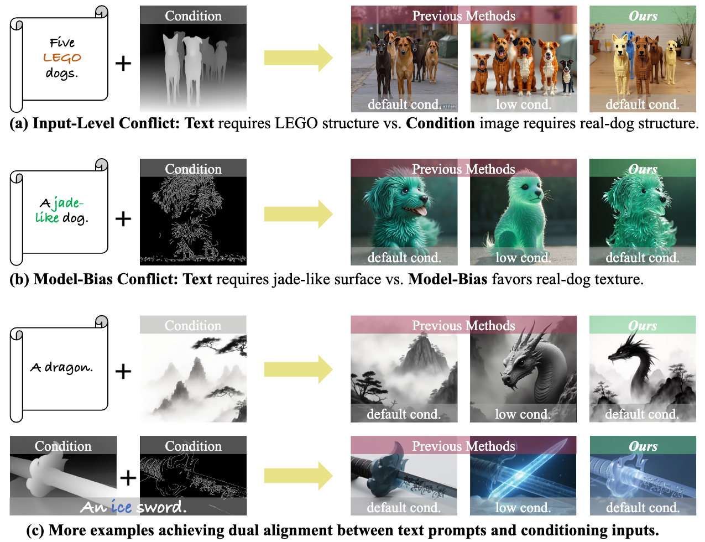
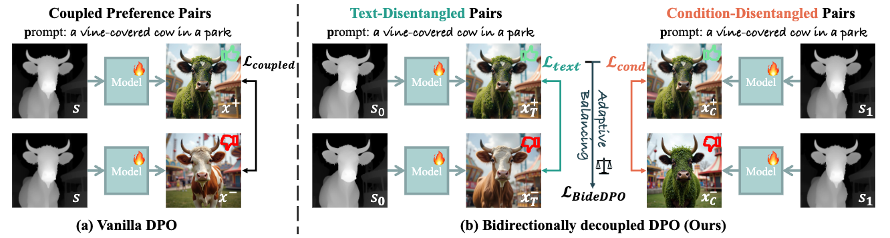
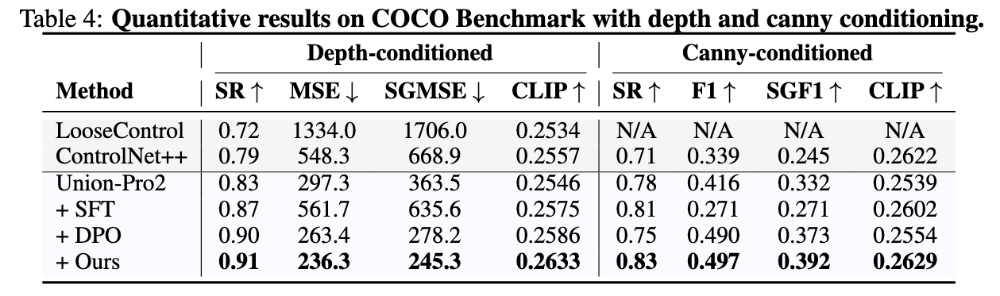
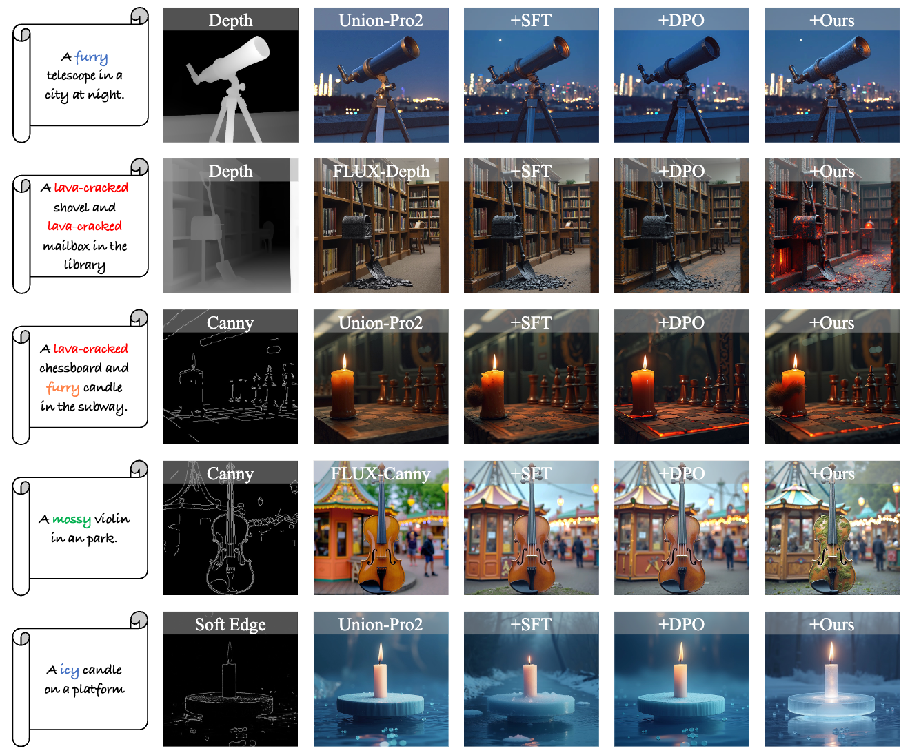

# BideDPO: Conditional Image Generation with Simultaneous Text and Condition Alignment

[](https://arxiv.org/abs/2511.19268)
[](https://limuloo.github.io/BideDPO/)
[](https://github.com/limuloo/BideDPO)
[](https://openreview.net/)

Official implementation for the paper: **BideDPO: Conditional Image Generation with Simultaneous Text and Condition Alignment**.

[Dewei Zhou<sup>1</sup>](https://github.com/limuloo), [Mingwei Li<sup>1</sup>](https://github.com/longxiang-ai), [Zongxin Yang<sup>2</sup>](https://z-x-yang.github.io/), [Yu Lu<sup>1</sup>](https://yulu.net.cn/), [Yunqiu Xu<sup>1</sup>](https://scholar.google.com/citations?user=SdJX4nAAAAAJ&hl=zh-CN), [Zhizhong Wang<sup>3</sup>](https://scholar.google.com/), [Zeyi Huang<sup>3</sup>](https://scholar.google.com/), [Yi Yang<sup>1✉</sup>](https://scholar.google.com/citations?user=RMSuNFwAAAAJ&hl=en)

*<sup>1</sup>Zhejiang University, <sup>2</sup>Harvard University, <sup>3</sup>Huawei Technologies Ltd., China*

*<sup>✉</sup>Corresponding author*

## News

* **[2026-01]**: BideDPO has been accepted by **ICLR 2026**! Code and benchmarks will be released soon.

## TODO

- [x] Release project page & arXiv
- [ ] Release inference code
- [ ] Release model weights
- [ ] Release training code
- [ ] Release DualAlign benchmark
- [ ] Release preference data generation pipeline
- [ ] Release Gradio demo

## Teaser


*Qualitative comparison on conflicts between text prompts and conditioning inputs, highlighting dual alignment achieved by BideDPO.*

## Method Overview


*Overview of BideDPO: bidirectionally decoupled preference pairs for text and condition, Adaptive Loss Balancing, conflict-aware data pipeline with VLM checks, and iterative optimization.*

## Highlights

- **Bidirectionally decoupled preference pairs** for text and condition
- **Adaptive Loss Balancing** to avoid gradient entanglement
- **Self-driven data pipeline** with VLM checks for conflict-aware pairs
- **Iterative optimization** that refines both model and data together
- **DualAlign benchmark** for evaluating text–condition conflict resolution
- Strong gains in **text success rate (+35%)** and **condition adherence**; robust on COCO

## Abstract

Conditional image generation augments text-to-image synthesis with structural, spatial, or stylistic priors and is used in many domains. However, current methods struggle to harmonize guidance from both sources when conflicts arise: 1) input-level conflict, where the semantics of the conditioning image contradict the text prompt, and 2) model-bias conflict, where learned generative biases hinder alignment even when the condition and text are compatible. These scenarios demand nuanced, case-by-case trade-offs that standard supervised fine-tuning struggles to deliver.

Preference-based optimization techniques, such as Direct Preference Optimization (DPO), offer a promising solution but remain limited: naive DPO suffers from gradient entanglement between text and condition signals and lacks disentangled, conflict-aware training data for multi-constraint tasks.

To overcome these issues, we propose a self-driven, bidirectionally decoupled DPO framework (**BideDPO**). At its core, our method constructs two disentangled preference pairs for each sample—one for the condition and one for the text—to mitigate gradient entanglement. The influence of these pairs is then managed by an Adaptive Loss Balancing strategy for balanced optimization. To generate these pairs, we introduce an automated data pipeline that iteratively samples from the model and uses vision-language model checks to create disentangled, conflict-aware data. Finally, this entire process is embedded within an iterative optimization strategy that progressively refines both the model and the data.

We construct a **DualAlign benchmark** to evaluate a model's ability to resolve conflicts between text and condition, and experiments on commonly used modalities show that BideDPO delivers substantial gains in both text success rate (e.g., +35%) and condition adherence. We also validated the robustness of our approach on the widely used COCO dataset.

## Results

### DualAlign Benchmark


*Benchmark results on DualAlign: evaluating conflict resolution between text and condition.*

### COCO Results


*Evaluation on the COCO dataset demonstrating robustness of BideDPO under multi-constraint alignment.*

### More Examples


*Additional cases achieving dual alignment across prompts and conditioning inputs, including abstract style conditions.*

## Getting Started

Code release is in preparation. This repository will host:

- Training scripts for BideDPO
- DualAlign benchmark and evaluation tools
- Example configs and inference demos
- Pre-trained model weights

**Environment (planned):**
- Python >= 3.10
- PyTorch >= 2.0
- diffusers, transformers, accelerate

## Citation

If you find BideDPO useful, please consider citing:

```bibtex
@misc{zhou2025bidedpo,
  title={BideDPO: Conditional Image Generation with Simultaneous Text and Condition Alignment}, 
  author={Dewei Zhou and Mingwei Li and Zongxin Yang and Yu Lu and Yunqiu Xu and Zhizhong Wang and Zeyi Huang and Yi Yang},
  year={2025},
  eprint={2511.19268},
  archivePrefix={arXiv},
  primaryClass={cs.CV},
  url={https://arxiv.org/abs/2511.19268}, 
}
```

## Acknowledgements

We thank the open-source community around diffusion models and preference optimization for inspiring this work. This work builds upon:

- [Stable Diffusion](https://github.com/CompVis/stable-diffusion) - Base diffusion model
- [FLUX](https://github.com/black-forest-labs/flux) - State-of-the-art text-to-image model from Black Forest Labs
- [ControlNet](https://github.com/lllyasviel/ControlNet) - Conditional control for diffusion models
- [Diffusers](https://github.com/huggingface/diffusers) - Diffusion models library

## Contact

For questions or issues, please open a GitHub issue or contact the authors.
